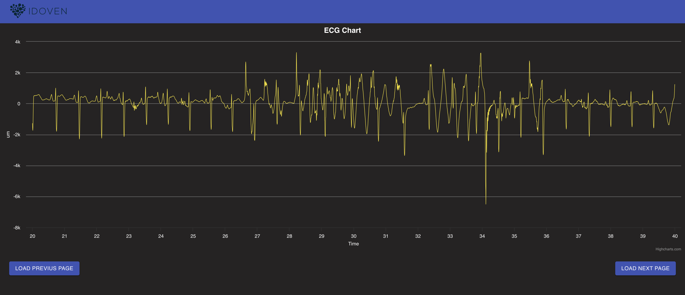

# ECG for Idoven

This project visualizes an Electrocardiogram (ECG) through a user-friendly graphical interface. The key challenge involved creating a display for extended ECG recordings, allowing users to easily navigate and select specific areas for closer inspection.

The main features of the project include:

- Analyzing and reading an ECG signal from a file in the data directory.
- Adding this proccesed data to the context.
- Displaying the ECG signal in a graph.
- Enabling to select specific areas for zooming.

## Tech Summary

The tech stack used was: 

- [React](https://reactjs.org/): The project is built using React for creating the user interface.
- [TypeScript](https://www.typescriptlang.org/): TypeScript was used to add static types to JavaScript, improving code safety and efficiency.
- [Material-UI](https://material-ui.com/): Material-UI was used for styling the application and providing a modern look.
- [Styled-components](https://styled-components.com/): Styled-components for some custom styles
- [HighCharts](https://www.highcharts.com/): HighCharts was used for the visual representation of the ECG signal due to how well it works with huge data loads.
- [React Testing Library](https://testing-library.com/docs/react-testing-library/intro/): Unit tests were written using React Testing Library and Jest to ensure the correctness and reliability of the application's codebase.



## Getting Started

To execute this project you will need to do the next steps:

After cloning the project, download the .zip data located in [releases](https://github.com/jesusvaros/ecg-idoven/releases/tag/v1.0.0)
and add it to the [dataFolder](https://github.com/jesusvaros/ecg-idoven/tree/v1.0.0/public/data).

Then you can:

1. Install

```bash
npm install
```
2. Start the project

```bash
npm start
```

The application should now be running locally and accessible in your web browser at http://localhost:3000/

## Running Tests

To execute the unit tests use the following command:

```bash
npm test
```
